# Kotori 🐦 - Language Learning Bot

Kotori is an AI-powered language learning assistant that helps you practice English and Japanese through conversational learning. It integrates with Anki flashcards to provide personalized vocabulary practice and tracks your learning progress.

## 🏗️ Architecture

Kotori provides two modes:
- Study mode: review your anki cards with help of AI
- Chat mode: chat with AI, with grammar fix and guide on improving naturalness
  
### Core Components

- **`kotori_bot.py`**: The heart of Kotori - implements a LangGraph-based state machine for conversation flow
- **Anki Integration**: Tools for reading flashcards and tracking learning progress
- **Web Backend**: FastAPI-based REST API and WebSocket support
- **React Frontend**: Modern UI for interactive learning sessions

## 📋 Prerequisites

- **Python 3.8+**
- **Node.js 16+** (for Web UI, if you are using CLI interface, this is not needed)
- **Anki Desktop** (with AnkiConnect plugin for flashcard integration)
- **Azure OpenAI** account (for AI capabilities)

## 🚀 Quick Start

### 1. Clone and Setup Environment

```bash
git clone https://github.com/rumycoding/kotori.git
cd kotori

# Copy environment template
cp .env.example .env
```

### 2. Configure Environment Variables

Edit `.env` file with your credentials, I am using `o4-mini`:

```env
# Azure OpenAI Configuration
AZURE_OPENAI_API_KEY=your_api_key_here
AZURE_OPENAI_ENDPOINT=https://your-endpoint.openai.azure.com/
AZURE_OPENAI_DEPLOYMENT_NAME=your_deployment_name
AZURE_OPENAI_API_VERSION=2024-02-15-preview
AZURE_MODEL_NAME=o4-mini

```

### 3. Install Dependencies

#### For CLI Only:

```bash
# Please setup your python venv first
pip install-r requirements.txt

```

#### For Full Setup (CLI + Web UI):

```bash
# Please setup your python venv first
# Install Python dependencies
pip install-r requirements.txt
pip install-r backend/requirements.txt

# Install Node.js dependencies
cd frontend
npm install

cd ..

```

### 4. Setup Anki (Optional but Recommended)
If you do not install anki, you could not run study mode

1. Install [Anki Desktop](https://apps.ankiweb.net/)
2. Install the [AnkiConnect](https://ankiweb.net/shared/info/2055492159) add-on
   * more detail instruction for this: [amikey/anki-connect: https://github.com/FooSoft/anki-connect.git](https://github.com/amikey/anki-connect)
3. Create a deck named "Kotori" (or specify your deck name in configuration)
4. Ensure Anki is running when using Kotori

## 🖥️ Usage

### CLI Interface

Run Kotori in command line mode:

```bash
# Windows
scripts\run_chatbot_cli.bat

# Linux/Mac
python main.py

```

**CLI Features:**

- Direct conversation with Kotori
- All core learning features available
- Perfect for trying

### Web UI Interface

Start the full web application:

```bash
# Windows - Automated startup
scripts\start_kotori_ui.bat

# Manual startup
# Terminal 1: Start backend
cd backend
python run_backend.py

# Terminal 2: Start frontend
cd frontend
npm start

```

**Web UI Features:**

- Interactive chat interface (with voice output and input)
- Real-time conversation flow visualization
- Learning progress dashboard
- Session history and analytics
- Debug panels for development

Access the web interface at: `http://localhost:3000`

## 🧠 Understanding `kotori_bot.py`

The `kotori_bot.py` file is the core intelligence of Kotori, implementing a sophisticated state machine using LangGraph for managing conversation flow and learning sessions.

### LangGraph Node Flow Visualization

```mermaid
graph TD
    START([START]) --> greeting[🤝 Greeting]
    
    greeting --> mode_selection[📋 Mode Selection]
    
    mode_selection --> |Chat Mode| chat_mode[💬 Chat Mode]
    mode_selection --> |Study Mode| study_mode[🎓 Study Mode]
    
    %% Study Mode Flow
    study_mode --> retrieve_cards[📚 Get Cards]
    retrieve_cards --> |Cards found| conversation[Vocabulary Practice]
    retrieve_cards --> |No cards| chat_mode
    conversation --> assessment[� Assessment]
    assessment --> |Continue| conversation
    assessment --> |New cards| retrieve_cards
    assessment --> |Switch mode| chat_mode
    
    %% Chat Mode Flow  
    chat_mode --> chat_eval[🔄 Evaluate Session]
    chat_eval --> |Continue| chat_mode
    chat_eval --> |Switch mode| study_mode
    
    %% Tools Integration
    conversation -.-> |needs tools| tools[🔧 Anki Tools]
    chat_mode -.-> |needs tools| tools
    tools -.-> |return| conversation
    tools -.-> |return| chat_mode
    
    %% Exit paths
    mode_selection --> END([END])
    chat_eval --> END
    assessment --> END

    %% Styling
    style greeting fill:#e1f5fe
    style mode_selection fill:#e1f5fe
    style chat_mode fill:#f3e5f5
    style study_mode fill:#e8f5e8
    style conversation fill:#e8f5e8
    style retrieve_cards fill:#fff3e0
    style assessment fill:#fff3e0
    style chat_eval fill:#fff3e0
    style tools fill:#fce4ec
```



#### Core Flow:
1. **Study Mode**: `Greeting` → `Mode Selection` → `Get Cards` → `Vocabulary Practice` ⟷ `Assessment`
2. **Chat Mode**: `Greeting` → `Mode Selection` → `Chat Mode` ⟷ `Evaluate Session`
3. **Tool Integration**: Both modes can call Anki tools (dotted lines) for flashcard operations

#### Key Components:
- **� User Interaction** (Blue): Direct user input and mode selection
- **🟢 Study Mode** (Green): Structured vocabulary practice with Anki cards  
- **🟣 Chat Mode** (Purple): Free conversation with language feedback to improve naturalness
- **🟡 Processing** (Orange): Internal logic for card retrieval and assessment
- **🔴 Tools** (Pink): Anki operations (add notes, answer cards, etc.)

#### **Assessment Engine**

AI will assess your performance based on:
- **Meaning Understanding**: Grasp of vocabulary concepts
- **Usage Accuracy**: Correct application in context
- **Naturalness**: Fluent, native-like usage

The assessment uses a 1-5 scale and provides specific feedback for targeted improvement.

## 📁 Project Structure

```

kotori/
├── kotoribot/                # 🧠 Core conversation engine, review this for main logic
├── anki/                     # Anki integration tools
├── backend/                  # FastAPI application
├── frontend/                 # User interface
│   └── public/               # config (like select language is here!)
├── scripts/                  # help you get start
└── main.py                   # CLI entry point
```

## ⚙️ Configuration

### Language Settings
Setting is in `main.py` for CLI and `frontend\public\kotori_config.json` for UI

```python

# English learning mode

config = {"language": "english", "deck_name": "English_Vocabulary", "temperature": 1}


# Japanese learning mode  

config = {"language": "japanese", "deck_name": "Japanese_Core", , "temperature": 1}

```

## 🚧 Limitations

### Performance Considerations
- **Single-threaded Processing**: The current implementation processes Anki operations sequentially, which may cause delays during card retrieval and assessment
- **Synchronous Anki Operations**: Card answering and assessment operations are not optimized for concurrent execution

### Error Handling
- **Limited Retry Logic**: Connection errors with Anki or Azure OpenAI may cause the bot to become unresponsive
- **Graceful Degradation**: The system lacks robust fallback mechanisms when external services fail

### Future Enhancements
- Multi-threading and asynchronous Anki card processing could significantly improve response times
- Implement retry mechanisms with exponential backoff for external API calls
- Add concurrent processing for Anki operations
- Improve error recovery and user feedback for connection issues

**Happy Learning with Kotori! 🐦✨**
