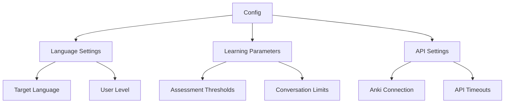

# Configuration Management

## Overview
This document details the configuration system for the Kotori language learning bot. The configuration is designed to be flexible and environment-aware while maintaining simplicity for PoC development.

## Configuration Schema



## Implementation

### Configuration Model
```python
class BotConfig(BaseModel):
    # Language Settings
    target_language: str
    default_user_level: str = "beginner"
    
    # Learning Parameters
    min_confidence_threshold: float = 0.7
    max_free_conversation_time: int = 600  # seconds
    vocabulary_detection_threshold: int = 2
    
    # API Settings
    anki_connect_url: str = "http://localhost:8765"
    anki_deck_name: str = "Kotori"
    request_timeout: int = 30  # seconds

    class Config:
        env_prefix = "KOTORI_"  # Enable env var overrides
```

## Configuration File (config.yaml)

```yaml
language:
  target: "japanese"
  user_level: "beginner"

learning:
  confidence_threshold: 0.7
  max_free_conversation: 600
  vocab_detection_threshold: 2

api:
  anki_connect:
    url: "http://localhost:8765"
    deck: "Kotori"
    timeout: 30
```

## Usage

### Loading Configuration
```python
def load_config(config_path: str = "config.yaml") -> BotConfig:
    """Load configuration from yaml file with environment variable override support"""
    with open(config_path) as f:
        config_data = yaml.safe_load(f)
    
    return BotConfig(**config_data)
```

### Environment Variable Override
Configuration values can be overridden using environment variables:

```bash
# Override target language
export KOTORI_TARGET_LANGUAGE=chinese

# Override Anki connection URL
export KOTORI_ANKI_CONNECT_URL=http://localhost:8766
```

## Configuration Parameters

### Language Settings
| Parameter | Type | Default | Description |
|-----------|------|---------|-------------|
| target_language | str | None | Target language for learning |
| default_user_level | str | "beginner" | Default user proficiency level |

### Learning Parameters
| Parameter | Type | Default | Description |
|-----------|------|---------|-------------|
| min_confidence_threshold | float | 0.7 | Minimum confidence score for card mastery |
| max_free_conversation_time | int | 600 | Maximum time in free conversation (seconds) |
| vocabulary_detection_threshold | int | 2 | Minimum occurrences to flag vocabulary gap |

### API Settings
| Parameter | Type | Default | Description |
|-----------|------|---------|-------------|
| anki_connect_url | str | "http://localhost:8765" | Anki-Connect API endpoint |
| anki_deck_name | str | "Kotori" | Default Anki deck name |
| request_timeout | int | 30 | API request timeout (seconds) |

## Best Practices

1. **Version Control**
   - Keep a template config file in version control
   - Ignore local config files containing sensitive data

2. **Validation**
   - All configuration values are validated on load
   - Type checking ensures configuration integrity
   - Default values provide fallback safety

3. **Development Workflow**
   - Use local config file for development
   - Use environment variables for quick testing
   - Document all configuration changes