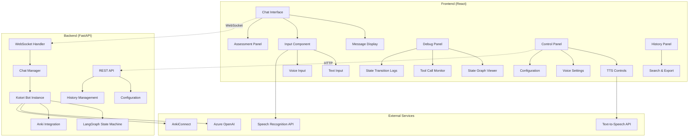

# Comprehensive UI Architecture Plan for Kotori Bot

## Overview

This document outlines the comprehensive plan for creating a React-based user interface with FastAPI backend for the kotori_bot system. The UI will feature real-time chat, voice capabilities, debugging tools, and advanced monitoring features.

## System Architecture

### Architecture Diagram



## Detailed Component Breakdown

### 1. Frontend Architecture (React + TypeScript)

#### Core Components:
- **ChatInterface**: Main container managing all UI components
- **MessageDisplay**: Renders AI/user messages with formatted text, markdown support
- **InputComponent**: Unified input with text/voice capabilities
- **AssessmentPanel**: Real-time conversation analysis and metrics
- **DebugPanel**: State graph visualization and debugging tools
- **ControlPanel**: TTS controls, voice settings, configurations
- **HistoryPanel**: Conversation history with search/export features

#### Key Technologies:
- React 18 with hooks and context
- TypeScript for type safety
- WebSocket client for real-time communication
- Web Speech API for voice input/output
- D3.js or React Flow for state graph visualization
- Material-UI or Tailwind CSS for modern styling
- React Query for efficient API state management

### 2. Backend Architecture (FastAPI + Python)

#### Core Modules:
- **WebSocket Manager**: Handle real-time chat communication
- **Chat Session Manager**: Manage multiple concurrent chat sessions
- **API Routes**: Configuration, history, and utility endpoints
- **KotoriBot Adapter**: Bridge between FastAPI and existing KotoriBot class
- **State Monitor**: Track and broadcast state changes for debugging

#### Integration Points:
- Existing KotoriBot class with minimal modifications
- KotoriState monitoring for real-time updates
- Anki integration via existing anki.py tools
- LangGraph state graph introspection for debugging

### 3. Real-time Features Implementation

#### WebSocket Events:
```typescript
// Frontend WebSocket Events
interface WebSocketEvents {
  // Chat Communication
  'user_message': { message: string, session_id: string }
  'ai_response': { message: string, session_id: string }
  
  // State Updates
  'state_change': { node: string, state: KotoriState }
  'tool_call': { tool: string, params: any, status: string }
  
  // Assessment Updates
  'assessment_update': { metrics: AssessmentMetrics }
  
  // Debug Information
  'debug_update': { graph_state: GraphState, transitions: Transition[] }
}
```

## Feature-Specific Implementation Plans

### A. Chat Interface with Formatted Text
- Rich text rendering with markdown support
- Code syntax highlighting for technical discussions
- Language-specific text formatting (English/Japanese)
- Message timestamps and status indicators
- Typing indicators during AI processing

### B. Voice Input & Speech Recognition
- Web Speech API integration
- Microphone permission management
- Real-time transcription display
- Voice activity detection
- Multiple language support (English/Japanese)

### C. Assessment Display
- Real-time conversation metrics from _assessment_node
- Progress visualization charts
- Learning goal tracking
- Performance trends over time

### D. Debug Panel with State Graph
- Interactive state graph visualization using React Flow
- Current node highlighting
- Edge traversal animation
- State transition history
- Tool call monitoring with parameters and results

### E. Text-to-Speech Implementation
- Web Speech API for voice synthesis
- Voice selection (male/female, different accents)
- Speed and pitch controls
- Auto-play toggle for AI responses
- Queue management for multiple messages

## Implementation Phases

### Phase 1: Core Infrastructure
1. Set up FastAPI backend with WebSocket support
2. Create React frontend with basic chat interface
3. Implement WebSocket communication layer
4. Integrate existing KotoriBot class

### Phase 2: Essential Features
1. Chat interface with message display
2. Text input with real-time communication
3. Basic state monitoring and display
4. Error handling and user notifications

### Phase 3: Advanced Features
1. Voice input/output capabilities
2. State graph visualization
3. Assessment panel with metrics
4. Tool call monitoring

### Phase 4: Polish & Enhancement
1. Conversation history with search/export
2. Configuration management
3. Advanced debugging features
4. Performance optimization

## Project Structure

```
kotori-ui/
├── backend/
│   ├── app/
│   │   ├── api/              # REST API routes
│   │   ├── websocket/        # WebSocket handlers
│   │   ├── models/           # Pydantic models
│   │   ├── services/         # Business logic
│   │   └── main.py          # FastAPI app
│   ├── kotoribot/           # Existing bot code
│   └── requirements.txt
├── frontend/
│   ├── src/
│   │   ├── components/      # React components
│   │   ├── hooks/           # Custom hooks
│   │   ├── services/        # API/WebSocket services
│   │   ├── types/           # TypeScript types
│   │   ├── utils/           # Utility functions
│   │   └── App.tsx
│   ├── package.json
│   └── tsconfig.json
└── README.md
```

## Key Integration Points

### Backend Integration:
- Minimal changes to existing KotoriBot class
- WebSocket wrapper around run_conversation method
- State change listeners for real-time updates
- Tool execution monitoring

### Frontend State Management:
- React Context for global state
- WebSocket connection management
- Real-time state synchronization
- Optimistic UI updates

## Security & Performance Considerations

- WebSocket authentication and session management
- Rate limiting for API endpoints
- Input validation and sanitization
- Efficient state update batching
- Memory management for long conversations
- Browser compatibility testing

## UI/UX Design Principles

- **Responsive Design**: Mobile-first approach with desktop enhancements
- **Accessibility**: WCAG 2.1 compliance with keyboard navigation
- **Dark/Light Mode**: User preference system
- **Progressive Enhancement**: Graceful degradation for older browsers
- **Real-time Feedback**: Immediate visual feedback for all user actions

## Technical Specifications

### Frontend Dependencies
```json
{
  "react": "^18.0.0",
  "typescript": "^5.0.0",
  "react-query": "^3.39.0",
  "react-flow": "^11.0.0",
  "material-ui": "^5.0.0",
  "socket.io-client": "^4.0.0",
  "react-markdown": "^8.0.0",
  "prism-react-renderer": "^1.3.0"
}
```

### Backend Dependencies
```python
fastapi>=0.104.0
uvicorn>=0.24.0
websockets>=12.0
pydantic>=2.5.0
python-socketio>=5.10.0
langchain>=0.1.0
langgraph
```

### Environment Variables
```env
# Existing variables from main.py
AZURE_OPENAI_API_KEY=
AZURE_OPENAI_ENDPOINT=
AZURE_OPENAI_DEPLOYMENT_NAME=
AZURE_OPENAI_API_VERSION=
APPLICATIONINSIGHTS_CONNECTION_STRING=
AZURE_MODEL_NAME=

# New UI-specific variables
FRONTEND_URL=http://localhost:3000
BACKEND_PORT=8000
WEBSOCKET_PATH=/ws
DEBUG_MODE=true
```

## API Endpoints

### REST API Routes
- `GET /api/config` - Get current configuration
- `POST /api/config` - Update configuration
- `GET /api/history/{session_id}` - Get conversation history
- `POST /api/history/export` - Export conversation history
- `GET /api/health` - Health check
- `GET /api/anki/status` - Check Anki connection

### WebSocket Endpoints
- `/ws/chat/{session_id}` - Main chat WebSocket connection
- `/ws/debug/{session_id}` - Debug information WebSocket

## Database Schema (Optional)

For persistent conversation history:

```sql
-- Conversations table
CREATE TABLE conversations (
    id UUID PRIMARY KEY,
    created_at TIMESTAMP DEFAULT NOW(),
    updated_at TIMESTAMP DEFAULT NOW(),
    user_id VARCHAR(255),
    language VARCHAR(10),
    deck_name VARCHAR(255)
);

-- Messages table
CREATE TABLE messages (
    id UUID PRIMARY KEY,
    conversation_id UUID REFERENCES conversations(id),
    content TEXT NOT NULL,
    message_type VARCHAR(20) NOT NULL, -- 'user', 'ai', 'system'
    created_at TIMESTAMP DEFAULT NOW(),
    metadata JSONB
);

-- Assessments table
CREATE TABLE assessments (
    id UUID PRIMARY KEY,
    conversation_id UUID REFERENCES conversations(id),
    assessment_data JSONB NOT NULL,
    created_at TIMESTAMP DEFAULT NOW()
);
```

## Testing Strategy

### Frontend Testing
- Unit tests with Jest and React Testing Library
- Component integration tests
- WebSocket connection mocking
- Accessibility testing with axe-core

### Backend Testing
- Unit tests with pytest
- WebSocket endpoint testing
- Integration tests with test database
- Load testing for concurrent connections

## Deployment Strategy

### Development Environment
- Frontend: `npm run dev` (Vite dev server)
- Backend: `uvicorn app.main:app --reload`
- Database: PostgreSQL in Docker

### Production Environment
- Frontend: Static build served by nginx
- Backend: FastAPI with gunicorn worker
- Database: Managed PostgreSQL service
- WebSocket: nginx proxy with proper headers

This comprehensive plan provides the foundation for building a modern, feature-rich user interface for the kotori_bot system while maintaining compatibility with existing functionality.