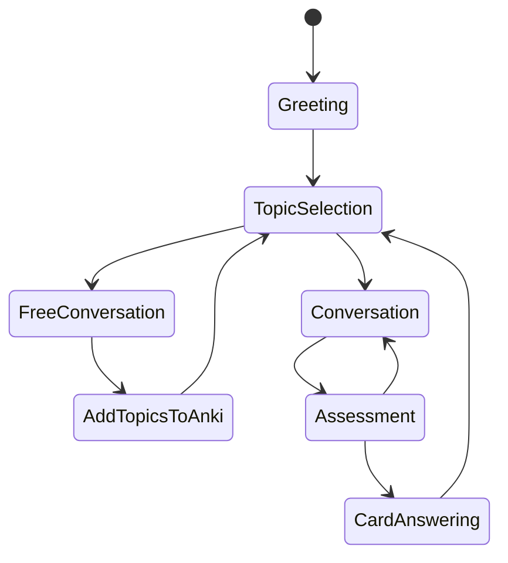

# Language Learning Bot Design

## Overview
This document details the design of a language learning bot that uses LangGraph for state management, combining fixed transitions for core conversation flow with dynamic transitions for learning assessment.

## State Management Architecture

### Core States


### State Transitions

#### 1. Fixed Transitions
These transitions follow a predetermined flow and are triggered by specific conditions:

- **Greeting → TopicSelection**
  - Trigger: Completion of initial greeting and learning goals collection
  - Data passed: User's learning goals, preferred topics
  ```python
  class GreetingState(BaseState):
      async def next(self, context: dict) -> str:
          if context.get("learning_goals") and context.get("user_level"):
              return "topic_selection"
          return "greeting"
  ```

- **TopicSelection → Conversation/FreeConversation**
  - Trigger: Attempt to retrieve relevant Anki cards
  - Decision logic:
    - If cards found: Go to Conversation
    - If no cards found: Go to FreeConversation
  ```python
  class TopicSelectionState(BaseState):
      async def next(self, context: dict) -> str:
          if context.get("active_cards"):
              return "conversation"
          return "free_conversation"
  ```

#### 2. Dynamic Transitions
These transitions are determined by real-time analysis of the conversation:

- **FreeConversation → TopicSelection**
  - Triggers:
    - Natural break in conversation
    - User expresses interest in specific topic
    - System identifies learning opportunity
  ```python
  class FreeConversationState(BaseState):
      async def next(self, context: dict) -> str:
          if self._should_attempt_structured_learning(context):
              return "topic_selection"
          return "free_conversation"

      def _should_attempt_structured_learning(self, context: dict) -> bool:
          # Check for:
          # 1. Natural conversation pause
          # 2. User mentioned interest in learning
          # 3. Identified vocabulary gaps
          # 4. Time spent in free conversation
          pass
  ```

- **Conversation ↔ Assessment**
  - Triggers:
    - User demonstrates understanding of vocabulary
    - User shows confusion or misuse of terms
    - Natural completion of a topic segment
  ```python
  class ConversationState(BaseState):
      async def next(self, context: dict) -> str:
          if self._should_assess_understanding(context):
              return "assessment"
          return "conversation"
          
      def _should_assess_understanding(self, context: dict) -> bool:
          # Analyze conversation for:
          # 1. Correct usage of target vocabulary
          # 2. Consistent demonstration of understanding
          # 3. Natural conversation milestone reached
          pass
  ```

### State Context Management

```python
class LearningContext(TypedDict):
    current_state: str
    active_cards: List[Dict[str, Any]]
    conversation_history: List[Message]
    demonstrated_knowledge: Dict[int, KnowledgeMetrics]
    learning_goals: str
    user_level: str
    current_topic: Optional[str]
    assessment_metrics: Dict[str, float]
    free_conversation_duration: int  # Time spent in free conversation
    identified_learning_opportunities: List[str]  # Topics/words identified during free chat

class KnowledgeMetrics(TypedDict):
    correct_usage_count: int
    context_understanding: float  # 0-1 score
    last_demonstrated: datetime
    confidence_score: float
```

## Implementation Strategy

### 1. Core State Flow
- Implement base state handler:
```python
class BaseState:
    async def run(self, context: dict) -> dict:
        # Common state processing logic
        pass

    async def next(self, context: dict) -> str:
        # State transition logic
        raise NotImplementedError
```

### 2. Free Conversation Manager
```python
class FreeConversationManager:
    def __init__(self):
        self.learning_opportunity_detector = LearningOpportunityDetector()
        self.topic_suggester = TopicSuggester()

    async def manage_conversation(self, context: LearningContext) -> dict:
        # Identify learning opportunities
        opportunities = self.learning_opportunity_detector.analyze(
            context.conversation_history
        )
        
        # Update context with identified opportunities
        context.identified_learning_opportunities.extend(opportunities)
        
        # Suggest transition to structured learning if appropriate
        if self._should_transition(context):
            return {"next_state": "topic_selection", 
                   "suggested_topic": self.topic_suggester.get_topic(opportunities)}
        
        return {"next_state": "free_conversation"}
```

### 3. Learning Opportunity Detection
```python
class LearningOpportunityDetector:
    def analyze(self, conversation_history: List[Message]) -> List[str]:
        """
        Analyze conversation to identify:
        - Vocabulary gaps
        - Grammar mistakes
        - Topics of interest
        - Repeated patterns requiring practice
        """
        opportunities = []
        # Implementation of analysis logic
        return opportunities
```

### 4. Topic Management
```python
class TopicManager:
    async def select_next_topic(self, 
                              context: LearningContext) -> Tuple[str, List[Dict]]:
        # Try to find cards for structured learning
        cards = await find_cards_to_talk_about(
            deck_name="Kotori",
            limit=5
        )
        
        if not cards:
            # If no cards found, suggest free conversation topics
            topics = self._generate_free_topics(context.learning_goals)
            return topics, []
            
        return self._generate_topic(cards), cards
```

## Key Improvements

1. **Flexible Learning Flow**
   - Seamless transition between structured and free conversation
   - Natural fallback when no cards are available
   - Opportunity detection during free conversation

2. **Systematic Assessment**
   - Continuous evaluation of user understanding
   - Multiple metrics for knowledge assessment
   - Natural conversation flow maintained

3. **Smart Card Answering**
   - Cards answered only when understanding is demonstrated
   - Confidence-based ease factor calculation
   - Integration with natural conversation flow

4. **Context Retention**
   - Persistent learning context across states
   - Historical performance tracking
   - Adaptive difficulty adjustment